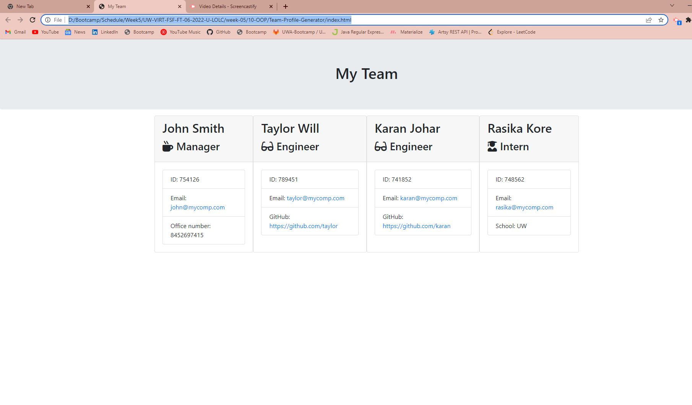

# Team-Profile-Generator
   

 A Node.js command-line application that takes in information about employees on a software engineering team, then generates an HTML webpage that displays summaries for each person.
 
   
  ## Overview
  This application will generate a HTML page with your team members details. 

  ## Description
  You can provide the correct information about your team members via cmd based application and  a HTML page with your team profile will be automatically generated.

  ## Table of Contents
  
1. [Installation](#installation)
2. [Usage](#usage)
3. [Licenses](#licenses)
4. [Contributing](#contributing)
5. [Tests](#tests)
6. [Questions](#questions)
  
  ## Installation
  To install various dependencies, run the following command:

  ``` 
  npm install 
  
  ``` 

  ## Usage
  command-line application that dynamically generates a team profile from a user's input.
  User can provide the manager details, and under tht manager, you can add engineers and interns. This application requires correct email format (yourname@company.com), correct emplyoee id digits(6) and correct office number digits(10).

  Refer this output HTML file
 
  Please follow the attached [ videoDemo](https://watch.screencastify.com/v/7EtdWx1Iz8kCgj4zrIrF)

  ## Licenses
    This project uses the MIT license. More info about licenses can be found [here](https://opensource.org/licenses/MIT)

  ## Contributing
  This project is open for contribution but please initiate an issue for any significant changes. [Contributor Covenant](https://www.contributor-covenant.org/)
  
  ## Tests
  To run tests, run the following command: 
  
  ``` 
  npm test
  
  ``` 
  

  ## Questions
  The developer can be reached through [Email](akshata.kumbhar@hotmail.com) or contacted through 
  [Github](https://github.com/akshu3011).

  